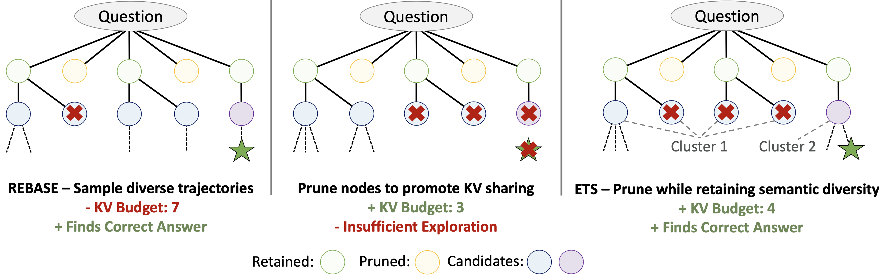

## ETS: Efficient Tree Search for Inference-Time Scaling

## TLDR

Test-time scaling has emerged as a new axis for improving model performance by leveraging additional computation at inference time in order to solve more challenging problems.

One promising approach for scaling compute at test time is through search, where a model generates multiple potential candidates and we then filter these candidates down to a selected trajectory. This type of search can be performed as a tree (where each level of the tree corresponds to taking an additional step towards solving the problem).

Previous tree search methods have either yielded reduced accuracy (due to performing insufficient exploration) or else have substantial efficiency penalties due to the high cost of exploring diverse trajectories (which leads to higher memory requirements due to a lack of shared KV cache state during the search process). 

**Our method, ETS, addresses this challenge by encouraging KV cache sharing in the search process to reduce memory consumption, while maintaining the exploration of semantically diverse trajectories which is critical for attaining high accuracy.** 

[**Paper**](https://www.arxiv.org/abs/2502.13575)

## Installation Instructions

These instructions will clone the repository to run our inference code, as well as the repository to set up the sglang environment. The sglang repository has been modified to support using a process reward model for efficient tree search.

    git clone https://github.com/SqueezeAILab/ETS.git
    cd ETS
    git clone https://github.com/chooper1/sglang-ets.git

    cd sglang-ets/python
    pip install .
    pip install outlines==0.0.44

The benchmark datasets used in our work can be obtained from: [MATH](https://github.com/hendrycks/math), [GSM8K](https://github.com/openai/grade-school-math).

## Launch Server for Generator and PRM
You can use **tmux** to start the servers, or run them in the background by adding **&** at the end of the scripts.
The generator and PRM should each be run on a separate GPU using **tmux**. The generator and policy model paths need to be configured to align with where models are downloaded locally on your machine.

    bash ./scripts/run_policy.sh
    bash ./scripts/run_reward.sh

## ETS Scripts

The hyperparameters for ETS can be configured in the ./hype-parameters/ets_WIDTH_math500.yaml 

ETS experiments can be run using the following script. This script assumes that the generator model is on GPU 0 and the reward model is on GPU 1. If the reward model is on another GPU, make sure the embed_device parameter in this script matches the GPU that the reward model is on in order to collocate the embedding model and reward model.

    bash ./scripts/ets_sweep_math500.sh

## Evaluate

GSM8K https://huggingface.co/datasets/openai/gsm8k

MATH500 https://github.com/openai/prm800k/tree/main/prm800k/math_splits/test.jsonl

You can select various aggregation functions for the scores at each step, such as last, mean, prod, or min. Additionally, you can modify the script to select answer based on best-of-n or weighted majority voting.

    bash ./scripts/evaluate.sh

## Citation
If you find our work helpful, please consider citing us:

    @article{hooper2025ets,
      title={ETS: Efficient Tree Search for Inference-Time Scaling},
      author={Hooper, Coleman and Kim, Sehoon and Moon, Suhong and Dilmen, Kerem and Maheswaran, Monishwaran and Lee, Nicholas and Mahoney, Michael W and Shao, Sophia and Keutzer, Kurt and Gholami, Amir},
      journal={arXiv preprint arXiv:2502.13575},
      year={2025}
    }

## References

Our inference code and modified sglang environment are based on code from [REBASE](https://arxiv.org/abs/2408.00724)
